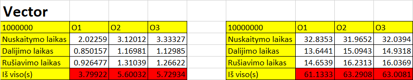

# Paleidimo instrukcija

1.Atsisiųskite programos versiją iš Releases.

2.Išarchyvuokite failus.

3.Atsidarykite aplankalą.

4.1 Paleiskite programą, paspaudus "run.bat".

4.2.1 Norint pasileisti programą per terminalą - užkomentuokite pirmą "duomenys.h" eilutę ir atkomentuokite antrą "duomenys.cpp".

   4.2.2 Norint sukompiliuoti programą per terminalą, įveskite komandą `g++ -O3 -o programa pirma_uzd.cpp`.

   4.2.3 Norint paleisti programą, per terminalą įveskite komandą `./programa`.

   4.3 Norint pasileisti programą per jūsų pasirinktą editorių - užkomentuokite antrą "duomenys.cpp" eilutę ir atkomentuokite pirmą "duomenys.h".

# V0.1 užduotis {

V0.1 užduotyje buvo parašytas programos pagrindas, kuris sugeneruoja duomenis ir nuskaito juos iš failo ir išveda juos į konsolę.

# }

# V0.2 užduotis {

V0.2 užduotyje buvo pridėtas nuskaitymas iš jau prieš tai nugeneruoto failo ir išvedimas į konsolę.

# }

# V0.3 užduotis {

V0.3 užduotyje buvo pridėti try catch blokai, kurie užtikrino programos veikimą. Taip pat programa buvo surūšiuota į header ir cpp failus.

# }

# V.04 užduotis {

# Tyrimas 1

Failų (1000, 10000, 100000, 1000000, 10000000) generavimas vidutiniškai (imant trijų generavimų vidurkį) užtruko 46.6222 s.

# Tyrimas 2

visi testai buvo atliekami po 3 kartus ir paimtas jų vidurkis.

# }

# V1.0 užduotis {

CPU:Intel(R) Core(TM) i7-10510U CPU @ 1.80GHz   2.30 GHz

RAM: 16.0 GB

SSD:KXG6AZNV512G TOSHIBA M.2 2280 

# }

# V1.1 užduotis {
Tyrimai atlikti su O1, O2, O3 optimizacijomis.

O1 flag'o exe failo dydis - 242KB

O2 flag'o exe failo dydis - 206KB

O3 flag'o exe failo dydis - 204KB

Palyginus rezultatus su struktūros ir klasės optimizacijomis, pastebėta, kad klasės optimizacija yra greitesnė (mazdaug 2 kartus) už struktūros optimizaciją. 
Taip pat pastebėta, kad O3 optimizacija yra greitesnė už O2 ir O1 optimizacijas.

# }

# V1.2 užduotis {

Copy construktorius - is vieno objekto nukopijuoja i kita objekta.

Copy assignment operatorius - is vieno objekto nukopijuoja i kita objekta, kai objektai jau egzistuoja.

Move construktorius - is vieno objekto perkelia i kita objekta, kai objektas neegzistuoja, ir objektas, is kurio keliame, yra sunaikinamas.

Move assignment operatorius - is vieno objekto perkelia i kita objekta, kai objektas jau egzistuoja, ir objektas, is kurio keliame, yra sunaikinamas.

Destruktorius - sunaikina objekta, kai jis nebereikalingas.

Input operatorius - leidzia nuskaityti objekta is failo ir perdengia default input operatoriu.

Output operatorius - leidzia isvesti objekta i faila ir perdengia default output operatoriu.

------------------------------
1000

|laikas | sek.        |
|---|-------------|
| Nuskaitymo laikas: | 0.0559618s |
| rusiavimo didejimo tvarka laikas: | 0.0007691s |
| dalinimo laikas: |  0.0018016s  |
| Is viso laiko:| 0.0585325s  |

------------------------------- 

------------------------------- 
10000

|laikas | sek.        |
|---|-------------|
| Nuskaitymo laikas: | 0.0935924s  |
| rusiavimo didejimo tvarka laikas: | 0.09089s    |
| dalinimo laikas: | 0.0085245s  |
| Is viso laiko:| 0.109313s   |

-------------------------------

-------------------------------
100000

|laikas | sek.       |
|---|------------|
| Nuskaitymo laikas: | 0.491717s  |
| rusiavimo didejimo tvarka laikas: | 0.09089s   |
| dalinimo laikas: | 0.0994205s |
| Is viso laiko:| 0.682028s   |

-------------------------------

-------------------------------
1000000

|laikas |sek. |
|---|---|
| Nuskaitymo laikas: | 3.03551s |
| rusiavimo didejimo tvarka laikas: | 0.907027s |
| dalinimo laikas: | 0.963172s |
| Is viso laiko:| 4.90571s |

-------------------------------

-------------------------------
10000000

|laikas |sek. |
|---|---|
| Nuskaitymo laikas: | 31.1019s |
| rusiavimo didejimo tvarka laikas: | 9.76324s |
| dalinimo laikas: | 10.3145s |
| Is viso laiko:| 51.1796s |

-------------------------------

Palyginus su praeita versija, pastebime, kad programa veikia greiciau.

Isvada - naudojant "rule of five" bei perdengiant ivedimo ir isvedimo operatorius, programa veikia greiciau.
# }